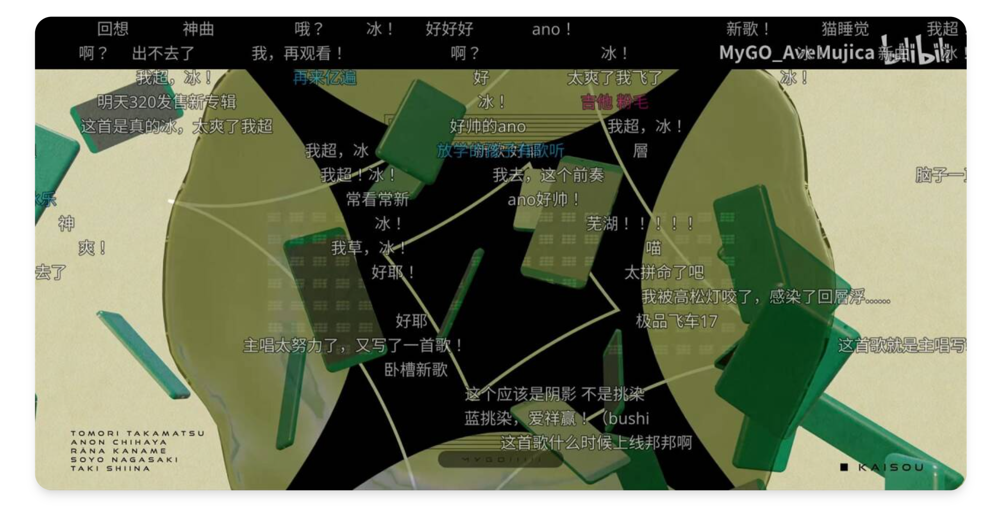

## 关于Bili Danmaku Downloader

这是一个自动下载B站视频并能将弹幕以ASS字幕形式保存的插件([仓库地址](https://github.com/summerkirakira/madokami-plugin-danmaku))。



## 添加下载

将视频链接(如: `https://www.bilibili.com/video/BV1Xw4m1C7K4/`)复制到管理订阅界面中对应插件的订阅地址中(订阅名留空即可)。

在此插件被触发更新后(参考[自动更新订阅](../startup/update_sub.md))，即可在下载管理菜单获取下载进度。

## 下载格式

本插件默认会在下载路径中添加三个文件：
+ 视频源文件
+ ASS字幕文件，可在播放器中直接调用
+ xml弹幕原文件
  
路径结构如下

```bash
番剧存放路径 # 可在插件设置界面中设置
    ├── 【Official Music Video】回層浮（Kaisou）⧸ MyGO!!!!!【原创歌曲】.mp4
    ├── 【Official Music Video】回層浮（Kaisou）⧸ MyGO!!!!!【原创歌曲】.mp4.danmaku.ass
    ├── 【Official Music Video】回層浮（Kaisou）⧸ MyGO!!!!!【原创歌曲】.mp4.danmaku.xml
```

你可以在本插件设置界面中自由启用或禁用ass和xml弹幕文件的生成。