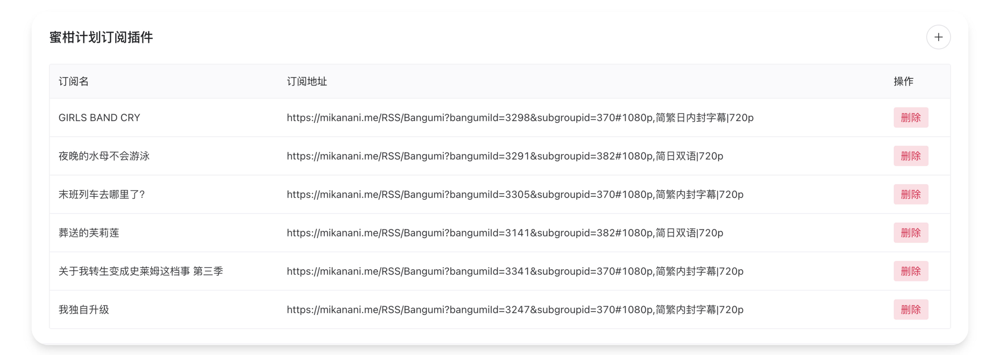
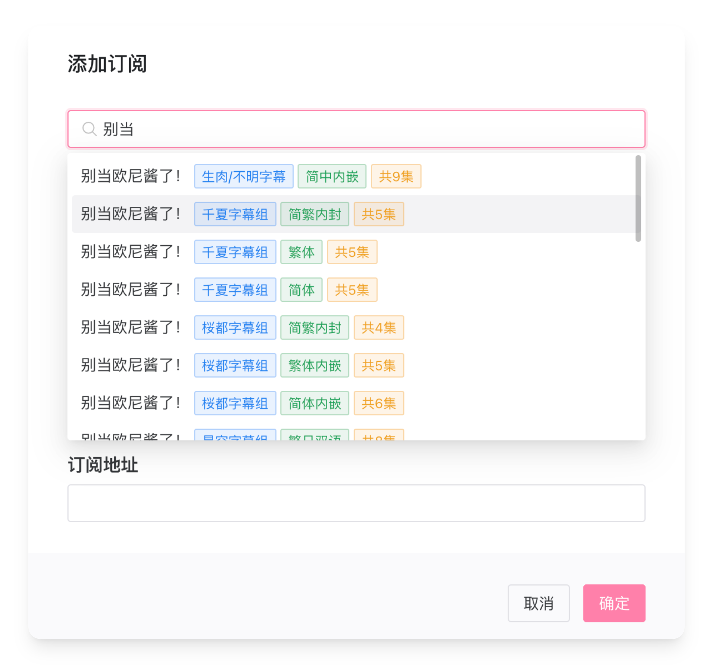
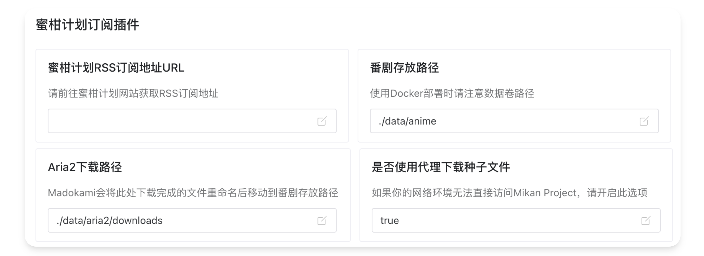

## 关于Mikan Project Parser
这是一个用于订阅蜜柑计划源的插件([仓库地址](https://github.com/summerkirakira/madokami-plugin-mikan-parser)), 为Madokami扩展了自动获取并下载最新番剧，并在下载完成后根据[番组计划](https://bangumi.tv)的元数据进行重命名的功能。

## 添加订阅
你可以用两种方式来为Madokami添加蜜柑计划源。


### 以番剧为单位 (推荐)

以番剧为单位为Madokami添加订阅源十分简单，点击左侧导航栏的订阅管理图标



并点击蜜柑计划卡片右上角的加号进入添加界面



在第一栏的搜索菜单中输入关键字，Madokami即可自动生成订阅地址，如果下拉框未出现，则说明与蜜柑计划的通讯被阻断，请前往[基础设置](../startup/basic_settings.md)为Madokami添加代理。

Mikan Parser默认提供了两种筛选器：
+ 优先关键字：如订阅源中提供了重复的同一集，标题中包含此关键字的条目会被优先下载。
+ 排除关键字：订阅源中所有包含此关键字的项目都将被过滤掉，即使会造成番剧缺集。


### 以个人订阅为单位

蜜柑计划提供了把个人订阅整理成一个统一的RSS源的功能，在[蜜柑计划主页](https://mikanani.me/)中点击RSS订阅，获取你个人的RSS订阅链接。


把它填入到设置中的蜜柑计划RSS订阅地址一栏中，Madokami即可在下次刷新中获取你在蜜柑计划网页上订阅的番剧。



## 下载配置

当番剧下载完成时，本插件会自动重命名并将其移动到设置中填写的番剧存放路径中，格式如下:
```bash
番剧存放路径
    ├── GIRLS BAND CRY
    │   ├── Season 1
    │   │    ├── GIRLS BAND CRY - S1E1 - 东京嘿咻.mkv
    │   │    ├── GIRLS BAND CRY - S1E2 - 三只夜行动物.mkv
    │   │    └── GIRLS BAND CRY - S1E3 - 无脑问答.mkv
    │   └── Season 2
    │   
    ├── 恋语轻唱
    │   └─── Season 1
```

Madokami需要访问Aria2下载完成的文件夹，请在Aria2下载路径中填入Aria2下载后文件所在的根目录。

## 定时更新策略

本插件由Madokami自动调度，请参考[自动更新订阅](../startup/update_sub.md)一节来修改Mikan源的检查频率。
